# Pose-Estimation

Essa atividade tem como objetivo utilizar-se do mediapipe para identificar os key points de gados, precisamente, de bovinos.

# Dataset

O dataset utilizado para o projeto foi **ANIMAL-POSE DATASET**, que pode ser encontrado no link a seguir: https://sites.google.com/view/animal-pose/

Dentro do site, temos a **Parte I** e **Parte II**, optou-se pela **Parte I**, devido ao json dos keypoints, que serão utilizados para validar o resultado do modelo.

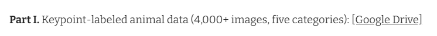

# Processamento do DataSet

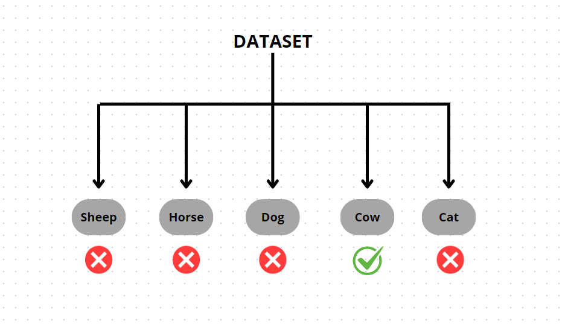

Com o dataset baixado, podemos visualizar 5 Pastas diferentes:

- Sheep
- Horse
- Dog
- Cow
- Cat

e um json contendo todas as coordenadas dos keypoints e das bounding boxes, caso necessário.

- keypoints.json

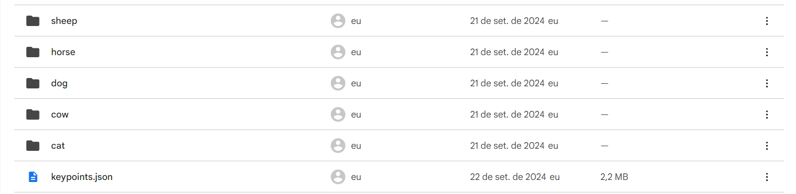


Para visualizar a distribuição das imagens entre as pastas, foi feito um código e logo em seguida, plotou-se um gráfico demonstrando a distribuição:

```
diretorio2 = []
images_dataset = []

for i in diretorio:
  dir_path = os.path.join(path, i)
  images = []
  for j in os.listdir(dir_path):
    if j.endswith(('jpg', '.png', 'jpeg')):
      images.append(j)
  images_dataset.append(len(images))

def grafico_qtd_images(diretorio, images_dataset):
  plt.figure(figsize=(12, 10))
  plt.bar(diretorio, images_dataset, color='Orange')
  plt.xlabel('Tipos de Animais')
  plt.ylabel('Quantidade')
  plt.title('Distribuição das Imagens de Animais')
  plt.xticks(rotation=45, ha='right')
  plt.tight_layout()
  plt.show()

grafico_qtd_images(diretorio, images_dataset)
```

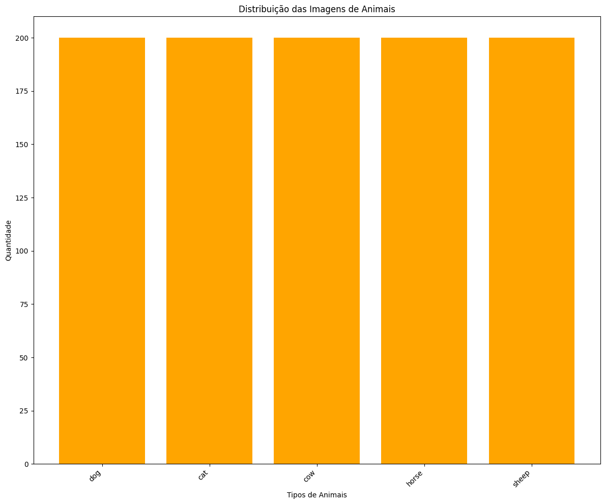

Conseguimos identificar que em todas as pastas temos 200 imagens, totalizando 1000 imagens de animais. Porém, como apenas as imagens de bovinos é importante, separamos elas e armazenamos em um array o "Path" delas.

```
images_vaca = []

for i in os.listdir(path):
  if i == 'cow':
    vacas = os.path.join(path, i)
    for j in os.listdir(vacas):
      if j.endswith(('.jpg', '.jpeg', '.png')):
        images_vaca.append(os.path.join(vacas, j))

print(images_vaca)
```
Resultado:

```
['/content/drive/MyDrive/animalpose_image_part2/cow/co125.jpeg', '/content/drive/MyDrive/animalpose_image_part2/cow/co49.jpeg', '/content/drive/MyDrive/animalpose_image_part2/cow/co170.jpeg', '/content/drive/MyDrive/animalpose_image_part2/cow/co60.jpeg', ...]
```

Para conseguimos visualizar as imagens das vacas, optou-se pela utilização das bibliotecas OpenCV e MatPlotLib. Realizamos a leitura da imagem com o OpenCV, como essa leitura é feita com o filtro BGR, precisamos modificar RGB, para que as cores fiquem em conformidade com a realidade. Logo, em seguida, realizamos a plotagem de 5 imagens de vacas.

```
def exibir_images(imagens, num_images=5):
  plt.figure(figsize=(12, 10))
  for idx, path in enumerate(imagens[:num_images]):
    img = cv2.imread(path)
    img = cv2.cvtColor(img, cv2.COLOR_BGR2RGB)
    plt.subplot(2, 3, idx+1)
    plt.imshow(img)
    plt.title(f'Imagem: {idx+1}')
    plt.axis('off')
  plt.tight_layout()
  plt.show()


exibir_images(images_vaca, num_images=5)
```

Resultado:


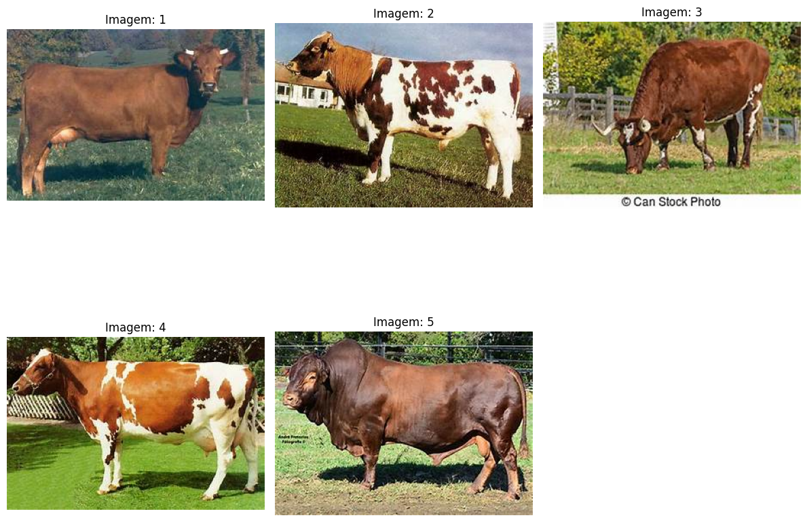

Antes de baixarmos e testarmos o modelo, criamos as imagens de validação.

```
import json

path_keypoint = '/content/drive/MyDrive/animalpose_image_part2/keypoints.json'
with open(path_keypoint, 'r') as f:
    data = json.load(f)

image_id_to_filename = data['images']
annotations = data['annotations']


def desenhar_keypoints(imagem_path):
    plt.figure(figsize=(40, 20)) 
    num_imagens = min(5, len(imagem_path)) 
    filename_to_image_id = {v: k for k, v in image_id_to_filename.items()}

    for idx, img_path in enumerate(imagem_path[:num_imagens]):
        imagem = cv2.imread(img_path)
        imagem = cv2.cvtColor(imagem, cv2.COLOR_BGR2RGB)

        img_name = os.path.basename(img_path)
        if img_name in filename_to_image_id:
            image_id = filename_to_image_id[img_name]

            annotation = next((a for a in annotations if a['image_id'] == int(image_id)), None)

            if annotation:
                keypoints = annotation['keypoints']


                for kp in keypoints:
                    x, y, v = kp
                    if v > 0: 
                        cv2.circle(imagem, (x, y), 5, (255, 0, 0), -1)
            else:
                print(f"Alerta: Anotações não encontradas para a imagem '{img_name}' (ID: {image_id})")
        else:
            print(f"Alerta: Imagem '{img_name}' não tem ID associado no JSON")

        plt.subplot(5, num_imagens, idx + 1)
        plt.imshow(imagem)
        plt.title(f'Imagem {idx+1}')
        plt.axis('off')

    plt.tight_layout()
    plt.show()

image_dir = '/content/drive/MyDrive/animalpose_image_part2/cow'
imagem_paths = [os.path.join(image_dir, img) for img in os.listdir(image_dir) if img.endswith(('.jpg', '.jpeg', '.png'))]

desenhar_keypoints(imagem_paths)
```

Resultado:

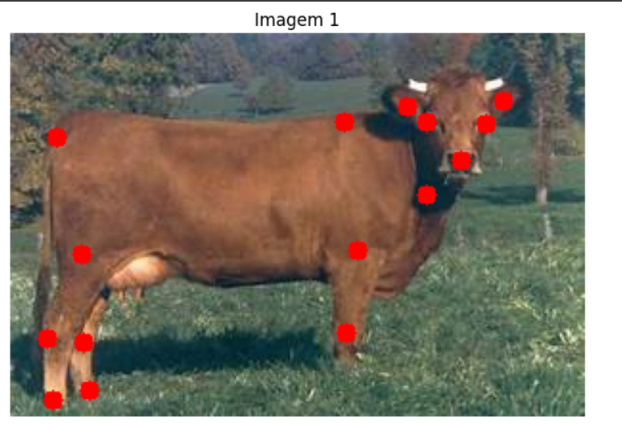

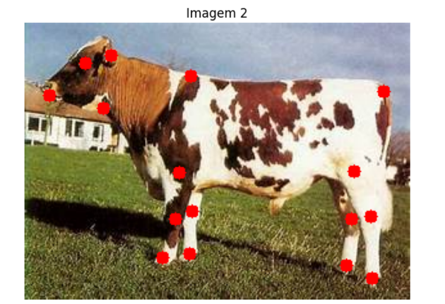

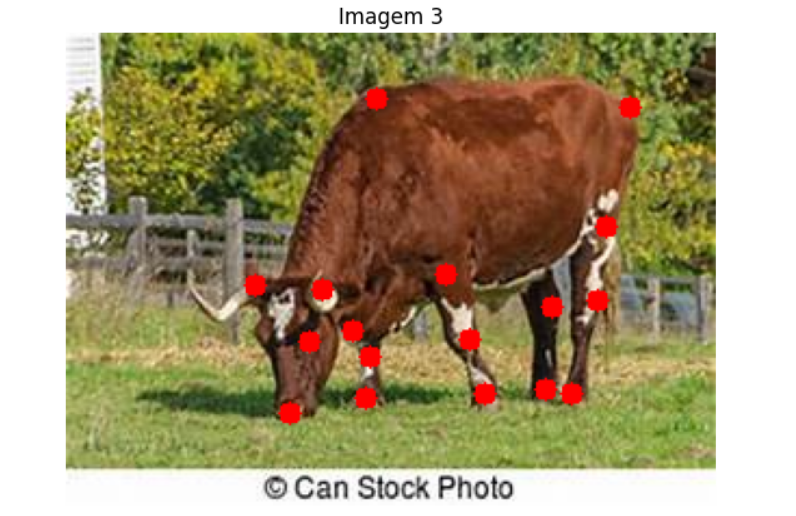

Depois, baixamos o media pipe que consiste em uma biblioteca desenvolvida pelo Google, amplamente, utilizada para tarefas envolvendo visão computacional como: Reconhecimento de Gestos, Rastreamento de Poses Humanas, reconhecimento facial, entre outros.

```
pip install mediapipe
```

Com o mediapipe baixado, tentamos fazer a inferência dos keypooints, para visualizar se o modelo consegue identificar o pose estimation dos bovinos.

```
import os
import cv2
import matplotlib.pyplot as plt
import mediapipe as mp

mp_pose = mp.solutions.pose
pose = mp_pose.Pose(static_image_mode=True)

def desenhar_pose(image, landmarks):
    mp_drawing = mp.solutions.drawing_utils
    mp_drawing_styles = mp.solutions.drawing_styles
    annotated_image = image.copy()

    mp_drawing.draw_landmarks(
        annotated_image,
        landmarks,
        mp_pose.POSE_CONNECTIONS,
        landmark_drawing_spec=mp_drawing_styles.get_default_pose_landmarks_style())

    return annotated_image

def estimar_pose_mediapipe(imagem_paths):
    imagem_paths = imagem_paths[:5]
    
    for idx, img_path in enumerate(imagem_paths):
        image = cv2.imread(img_path)
        image_rgb = cv2.cvtColor(image, cv2.COLOR_BGR2RGB) 
        results = pose.process(image_rgb)

        if results.pose_landmarks:
            annotated_image = desenhar_pose(image_rgb, results.pose_landmarks)

            plt.figure(figsize=(6, 6))
            plt.imshow(annotated_image)
            plt.title(f'Pose Estimada - Imagem {idx+1}')
            plt.axis('off')
            plt.show()
        else:
            print(f"Nenhuma pose encontrada para a imagem {img_path}")
            plt.figure(figsize=(6, 6))
            plt.imshow(image_rgb) 
            plt.title(f'Imagem original - {idx+1}')
            plt.axis('off')
            plt.show()
image_dir = '/content/drive/MyDrive/animalpose_image_part2/cow'
imagem_paths = [os.path.join(image_dir, img) for img in os.listdir(image_dir) if img.endswith(('.jpg', '.jpeg', '.png'))]
estimar_pose_mediapipe(imagem_paths)
```

# Resultados Finais:

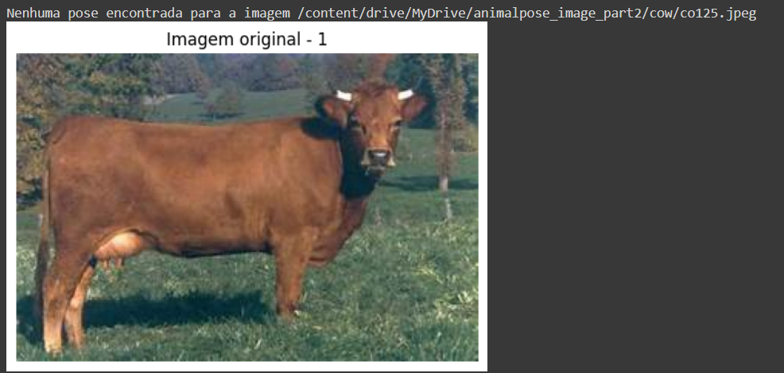

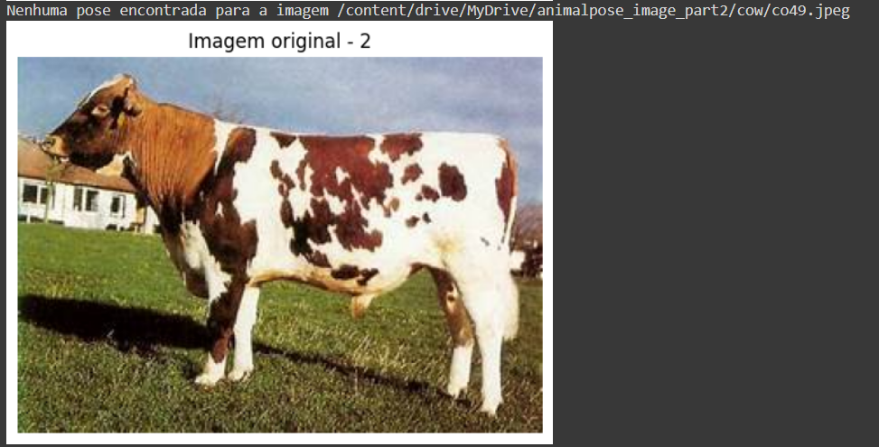

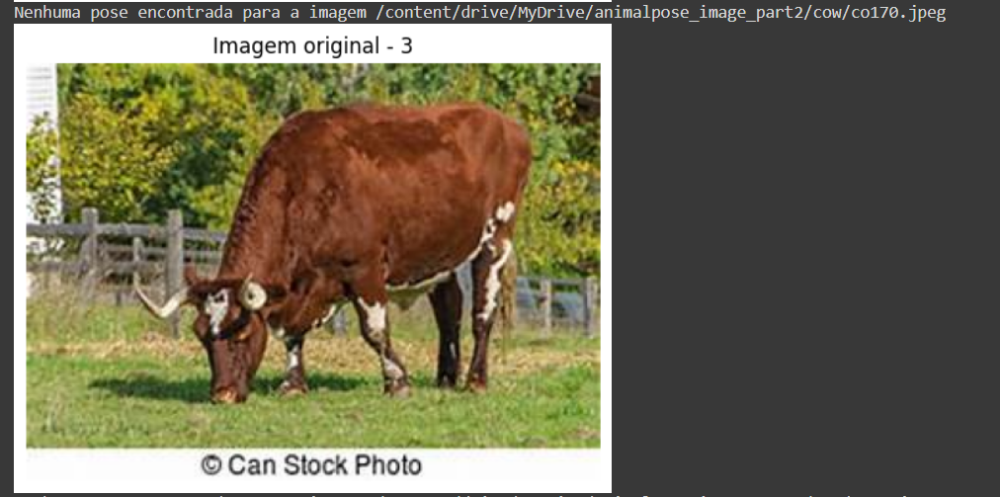

# Conclusões

Portanto, podemos concluir que o modelo não conseguiu realizar a estimativa de poses nos bovinos. Isso provavelmente ocorre porque o modelo foi treinado especificamente para estimar a pose de seres humanos, e, como resultado, ele não é capaz de identificar corretamente os keypoints em animais, como bois e vacas.

Sugestão de futuros trabalhos: Treinar um modelo de pose estimation que utilize imagens de animais, mais precisamente, de bovinos. Além disso, criar as labels para ajudar no treinamento do modelo.

